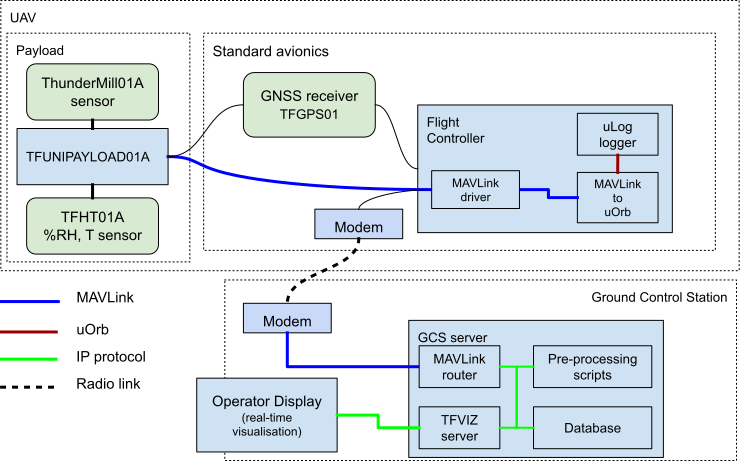
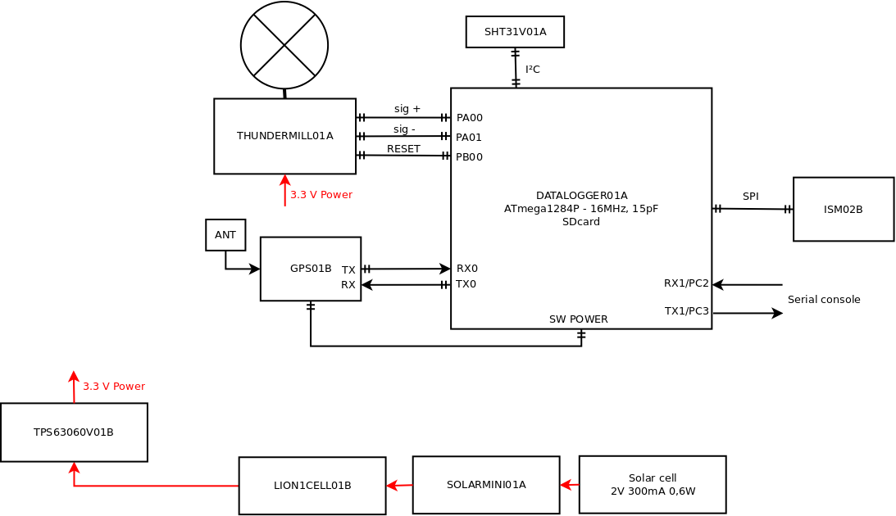

## Version for airborne measurement on board UAV

In case of arborne measurement by UAV the sensor should be a part of the TF-ATMON system.

## Portable Version for car or stationary measurements

