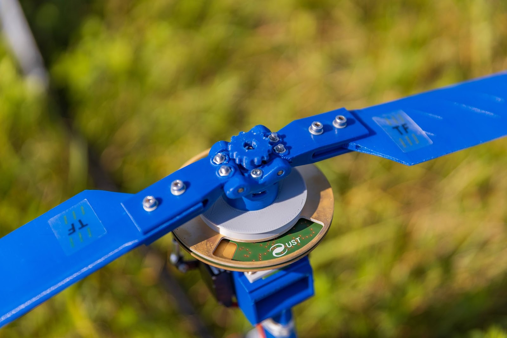
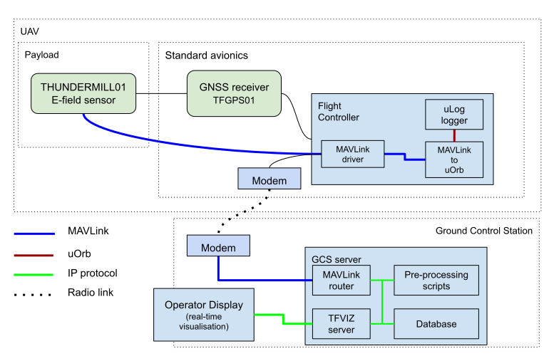
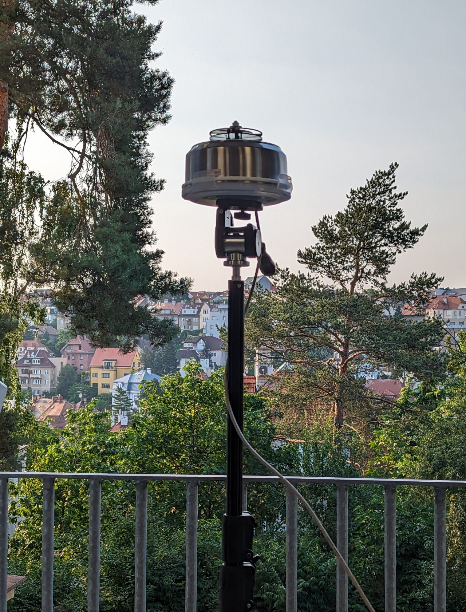

THUNDERMILL01 is an open-source [Electric field mill](https://en.wikipedia.org/wiki/Field_mill) sensor for static, portable and airborne measurements. The device is equipped with open-source software that provides high flexibility from the point of view of data output. The sophisticated design of the sensor provides the ability to use the sensor for many applications. The sensor can be operated statically at a fixed location or on mobile measuring devices or may be mounted on unmanned aerial vehicles.

## Version for airborne measurements on board UAV

In the case of airborne measurements by UAV, the sensor is intended to be used with the TF-ATMON. [TF-ATMON system](https://www.thunderfly.cz/tf-atmon.html) provides real-time data transmission to the ground station where it is visualized in a 3D map and provides the drone operator with a fast and flexible response to the measured data.

The sensor is commonly operated and equipped on the [ThunderFly TF-G2](https://www.thunderfly.cz/tf-g2.html) autogyro drone. In that case, the THUNDERMILL device is connected to on-board avionics as is displayed in the following diagram.  

## Outdoor Usage of the THUNDERMILL01 Sensor

For both stationary and portable applications, we offer a rugged outdoor variant of the UST THUNDERMILL01 sensor. This special configuration is optimized for outdoor installation, capable of withstanding harsh weather conditions and other external influences.

The sensor is ideal for industrial environments that require accurate and reliable measurements of electrical fields outdoors. Thanks to its robust design and high-quality materials, the sensor can precisely measure the intensity of the electric field generated by electrical charges in clouds passing over the device. It is therefore ideal not only for research purposes in meteorology and electromagnetism but also as an effective warning system for approaching storms. One of USTS THUNDERMILL01 EFM sensor is successfully in operation at the prestigious high-mountain observatory Lomnický štít, where it provides key data for meteorological measurements and research.

The outdoor version of the THUNDERMILL01 sensor is suitable for installation in locations with a high risk of lightning strikes, such as industrial wide-spread areas, recreational areas, sports facilities, or other places where people often gather. The presence of this sensor can significantly contribute to the safety of people and equipment in these areas.
